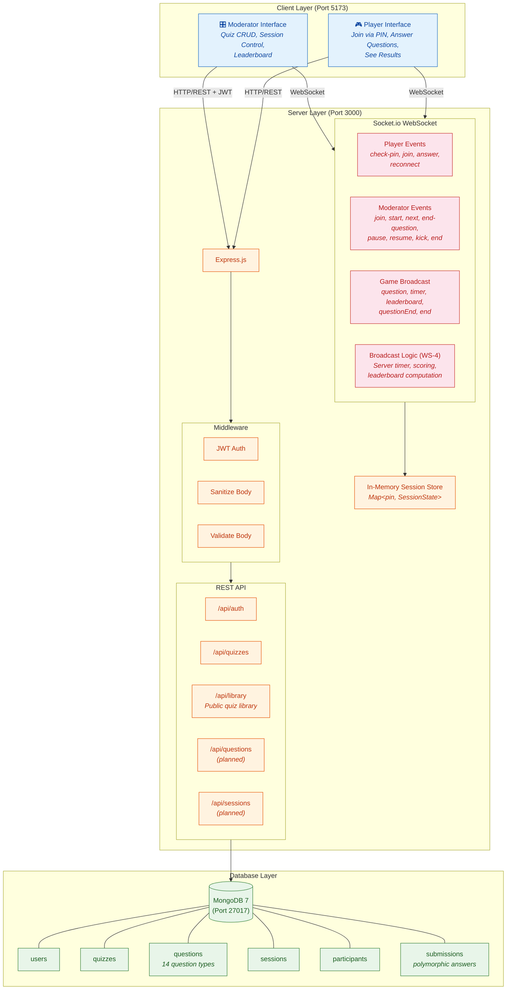
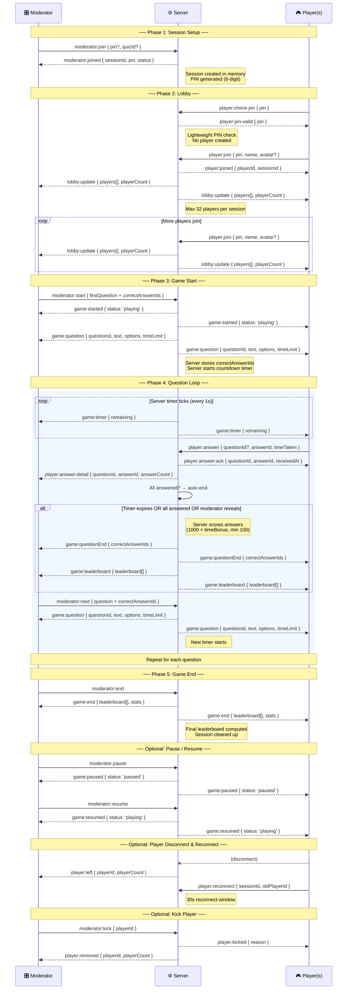
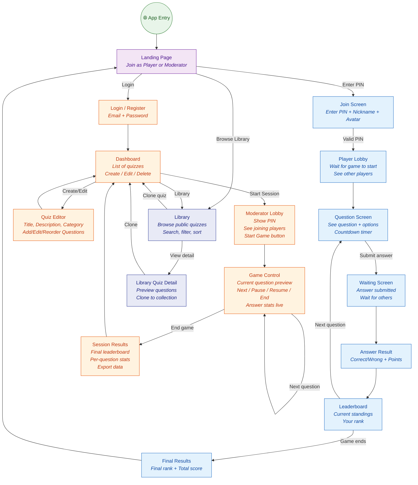
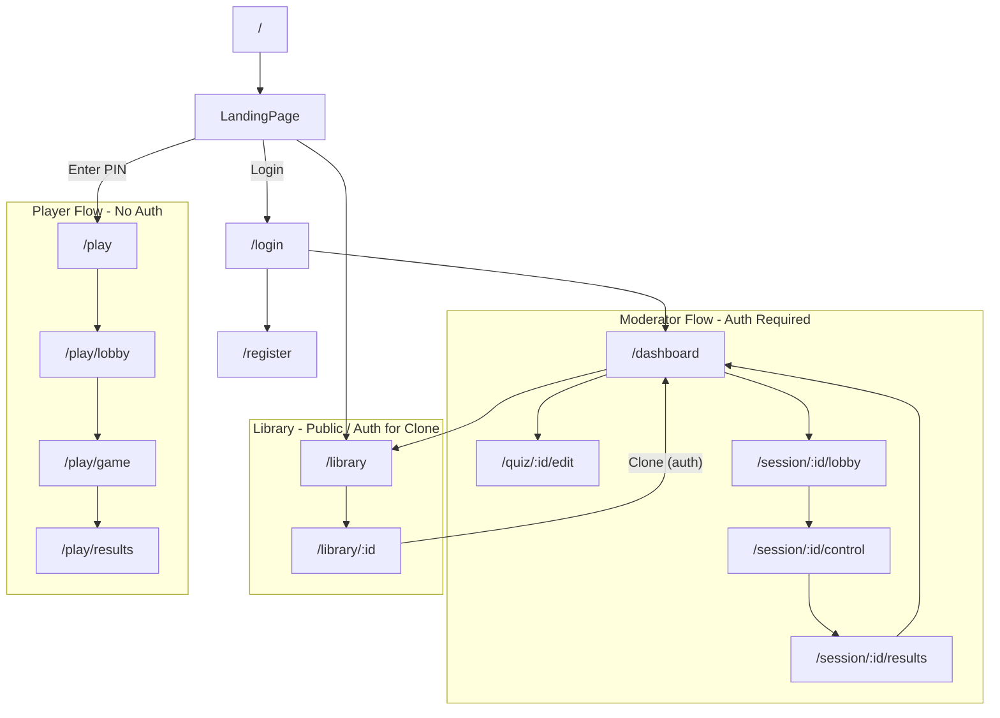

# Answr – System Architecture

## 1. System Architecture

High-level overview of all layers, services, and communication protocols.



### Infrastructure (Docker Compose)

| Service   | Image     | Port  | Notes                        |
|-----------|-----------|-------|------------------------------|
| `mongo`   | mongo:7   | 27017 | Persistent volume            |
| `backend` | Node.js   | 3000  | Depends on `mongo`           |
| Frontend  | Vite dev  | 5173  | Runs locally (not in Docker) |

---

## 2. API Route Map

All implemented and planned REST endpoints.

```mermaid
graph LR
  API["/api"]

  API --> AUTH["/auth"]
  AUTH --> AUTH_REG["POST /register<br/>🔓 Public<br/><i>Create account</i>"]
  AUTH --> AUTH_LOG["POST /login<br/>🔓 Public<br/><i>Login, get JWT</i>"]
  AUTH --> AUTH_ME["GET /me<br/>🔒 Auth<br/><i>Current user</i>"]

  API --> QUIZ["/quizzes"]
  QUIZ --> Q_LIST["GET /<br/>🔒 Auth<br/><i>List user's quizzes</i>"]
  QUIZ --> Q_GET["GET /:id<br/>🔒 Auth<br/><i>Quiz + questions</i>"]
  QUIZ --> Q_CREATE["POST /<br/>🔒 Auth<br/><i>Create quiz</i>"]
  QUIZ --> Q_UPDATE["PUT /:id<br/>🔒 Auth<br/><i>Update quiz</i>"]
  QUIZ --> Q_DELETE["DELETE /:id<br/>🔒 Auth<br/><i>Delete quiz + questions</i>"]

  API --> QUESTIONS["/questions<br/><i>(planned)</i>"]
  QUESTIONS --> QN_ADD["POST /quizzes/:quizId/questions<br/>🔒 Auth"]
  QUESTIONS --> QN_UPDATE["PUT /questions/:id<br/>🔒 Auth"]
  QUESTIONS --> QN_DELETE["DELETE /questions/:id<br/>🔒 Auth"]
  QUESTIONS --> QN_REORDER["PUT /quizzes/:quizId/questions/reorder<br/>🔒 Auth"]

  API --> SESSIONS["/sessions"]
  SESSIONS --> S_CREATE["POST /<br/>🔒 Auth<br/><i>Create session</i>"]
  SESSIONS --> S_GET["GET /:id<br/>🔒 Auth<br/><i>Session details</i>"]
  SESSIONS --> S_DELETE["DELETE /:id<br/>🔒 Auth<br/><i>End session</i>"]
  SESSIONS --> S_RESULTS["GET /:id/results<br/>🔒 Auth<br/><i>Final stats</i>"]

  API --> LIBRARY["/library"]
  LIBRARY --> L_BROWSE["GET /<br/>🔓 Public<br/><i>Browse library</i>"]
  LIBRARY --> L_GET["GET /:id<br/>🔓 Public<br/><i>Quiz detail</i>"]
  LIBRARY --> L_CLONE["POST /:id/clone<br/>🔒 Auth<br/><i>Clone to collection</i>"]
  LIBRARY --> L_PUBLISH["PUT /publish/:id<br/>🔒 Auth<br/><i>Publish quiz</i>"]
  LIBRARY --> L_UNPUBLISH["PUT /unpublish/:id<br/>🔒 Auth<br/><i>Unpublish quiz</i>"]
  LIBRARY --> L_OFFICIAL["POST /official<br/>🔒 Admin<br/><i>Create official quiz</i>"]

  API --> HEALTH["GET /health<br/>🔓 Public<br/><i>(planned)</i>"]

  classDef implemented fill:#c8e6c9,stroke:#2e7d32,color:#1b5e20
  classDef planned fill:#fff9c4,stroke:#f9a825,color:#f57f17

  class AUTH_REG,AUTH_LOG,AUTH_ME implemented
  class Q_LIST,Q_GET,Q_CREATE,Q_UPDATE,Q_DELETE implemented
  class S_CREATE,S_GET,S_DELETE,S_RESULTS implemented
  class L_BROWSE,L_GET,L_CLONE,L_PUBLISH,L_UNPUBLISH,L_OFFICIAL implemented
  class QN_ADD,QN_UPDATE,QN_DELETE,QN_REORDER planned
  class HEALTH planned
```



**Legend:** 🟩 Implemented &nbsp; 🟨 Planned

---

## 3. WebSocket Event Flow

Complete game lifecycle — from lobby creation to final leaderboard.



---

## 4. Screen Flow

Frontend screens and navigation paths (Vue 3 application).



**Legend:** 🟦 Player screens &nbsp; 🟧 Moderator screens &nbsp; 🟪 Shared

---

## 5. Frontend Routing

Two separate flows sharing the same Vue app: Moderator (auth-gated via JWT) and Player (PIN-based, no auth).



### Route Table

| Path | Component | Auth? | Description |
|------|-----------|-------|-------------|
| `/` | LandingPage | No | Enter PIN or navigate to login |
| `/login` | LoginPage | No | Moderator login |
| `/register` | RegisterPage | No | Moderator registration |
| `/dashboard` | DashboardPage | Yes | Quiz list, create/edit/delete |
| `/quiz/:id/edit` | QuizEditPage | Yes | Quiz editor |
| `/library` | LibraryPage | No | Browse public quiz library |
| `/library/:id` | LibraryDetailPage | No | Library quiz preview + clone |
| `/session/:id/lobby` | SessionLobbyPage | Yes | Show PIN, wait for players |
| `/session/:id/control` | GameControlPage | Yes | Live game control |
| `/session/:id/results` | SessionResultsPage | Yes | Final leaderboard + stats |
| `/play` | PlayerJoinPage | No | Enter PIN + name |
| `/play/lobby` | PlayerLobbyPage | No | Waiting for host to start |
| `/play/game` | PlayerGamePage | No | Answer questions |
| `/play/results` | PlayerResultsPage | No | Final rank + score |

### Frontend Tech Stack

| Layer | Technology |
|-------|-----------|
| Framework | Vue 3 (Composition API) |
| Routing | Vue Router 5 |
| State Management | Pinia |
| Styling | Tailwind CSS v4 |
| WebSocket | Socket.io Client |
| Build Tool | Vite |

### State Management (Pinia Stores)

- **authStore** -- `token`, `user`, `isAuthenticated`, `login()`, `register()`, `logout()`, `fetchMe()`. Token persisted in `localStorage`.
- **gameStore** -- Player-side state: `pin`, `playerId`, `sessionId`, `playerName`, `status`, `players`, `currentQuestion`, `leaderboard`, `answerResult`. Also stores final `leaderboard` from `game:end` for the results screen.

---

## Deployment Strategy

```
Development:
  Frontend  → Vite Dev Server (:5173)
  Backend   → Nodemon (:3000)
  Database  → Docker MongoDB (:27017)

Production (planned):
  Frontend  → Static Build → CDN / Nginx
  Backend   → PM2 / Docker → Cloud Server
  Database  → MongoDB Atlas / Self-hosted
```

## Security Checklist

- [x] JWT for Moderator Auth
- [x] Password Hashing (bcrypt)
- [x] CORS Configuration
- [x] Input Sanitization Middleware
- [ ] HTTPS/WSS in Production
- [ ] Rate Limiting
- [ ] Helmet.js Security Headers

## Scaling (Future)

- [ ] Redis for session state (replace in-memory Map)
- [ ] Load Balancer for horizontal scaling
- [ ] Socket.io Redis Adapter for multi-instance WebSocket
- [ ] CDN for static assets
