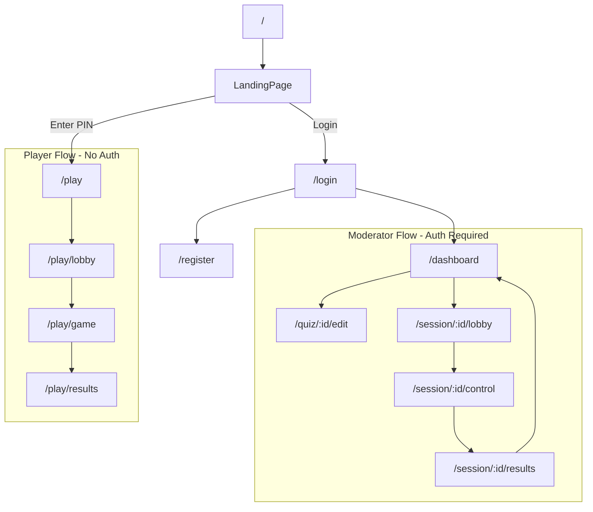

# Answr Frontend (Vue 3)

Vue-3-basiertes Frontend für die Answr Quiz-Plattform, gebaut mit Vite.

## Setup

```bash
# Dependencies installieren
npm install

# Entwicklungsserver starten
npm run dev
```

Frontend läuft auf: http://localhost:5173

## Tech Stack

- **Vue 3** -- Composition API
- **Vue Router** -- client-side routing
- **Pinia** -- state management
- **Tailwind CSS v4** -- utility-first styling
- **Socket.io Client** -- WebSocket communication

## Ordnerstruktur

```
src/
├── main.js                 # Vue Entry Point (registers Pinia + Router)
├── App.vue                 # Shell component with <router-view />
├── styles.css              # Tailwind CSS import
├── router/
│   └── index.js            # Route definitions + auth navigation guard
├── stores/
│   ├── authStore.js        # Auth state: token, user, login/register/logout
│   └── gameStore.js        # Player game state: pin, question, leaderboard
├── pages/
│   ├── LandingPage.vue     # Landing: join with PIN or host a quiz
│   ├── LoginPage.vue       # Moderator login
│   ├── RegisterPage.vue    # Moderator registration
│   ├── DashboardPage.vue   # Quiz list (moderator)
│   ├── QuizEditPage.vue    # Quiz editor (moderator)
│   ├── SessionLobbyPage.vue  # Moderator lobby (show PIN, wait for players)
│   ├── GameControlPage.vue   # Moderator game control (next question, etc.)
│   ├── SessionResultsPage.vue # Session results (moderator)
│   ├── PlayerJoinPage.vue  # Player: enter PIN + name
│   ├── PlayerLobbyPage.vue # Player: waiting for game start
│   ├── PlayerGamePage.vue  # Player: answer questions
│   └── PlayerResultsPage.vue # Player: final results
└── lib/
    └── socket.js           # Socket.io client (connect/disconnect/getSocket)
```

## View-Diagramm

Zwei getrennte Flows: Moderator (Auth-geschützt) und Spieler (PIN-basiert).



## Routes

| Path | Page | Auth? |
|------|------|-------|
| `/` | LandingPage | No |
| `/login` | LoginPage | No |
| `/register` | RegisterPage | No |
| `/dashboard` | DashboardPage | Yes |
| `/quiz/:id/edit` | QuizEditPage | Yes |
| `/session/:id/lobby` | SessionLobbyPage | Yes |
| `/session/:id/control` | GameControlPage | Yes |
| `/session/:id/results` | SessionResultsPage | Yes |
| `/play` | PlayerJoinPage | No |
| `/play/lobby` | PlayerLobbyPage | No |
| `/play/game` | PlayerGamePage | No |
| `/play/results` | PlayerResultsPage | No |

## Entwicklung starten

```bash
npm run dev        # Vite dev server
npm run build      # Production build
npm run lint       # ESLint
npm run format     # Prettier
```
